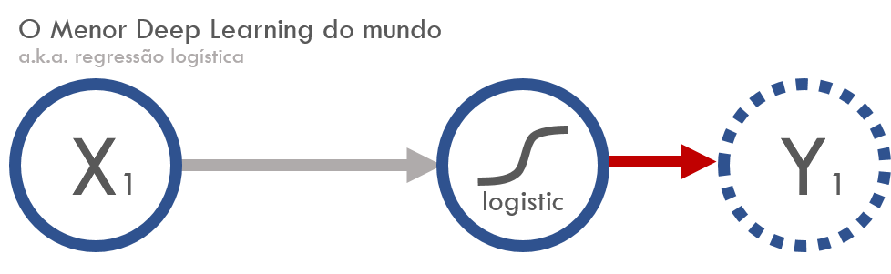
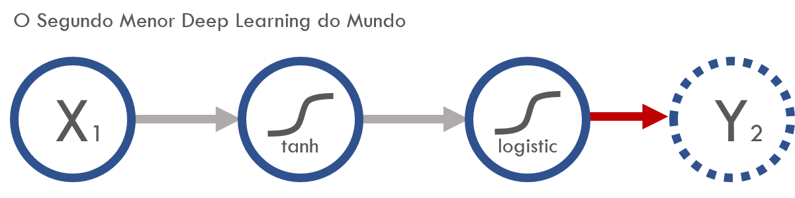
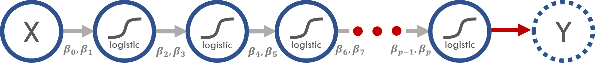

Deep learning 

## Objetivos

A finalidade do post é:

- aproximar o Deep Learning do que já havia de conhecido pela maioria dos analistas de dados.
- instigar a todos que vieram antes do deep learning a estudar e a ficar à vontade com as novidades em torno dela.
- mostrar que muitos profissionais inseridos na área de machine learning já conheciam grande parte do que o deep learning usa.
- levantar discussão sobre alguns mitos que não são construtivos para a comunidade dos analistas de dados.

## O que me motivou a escrever sobre isso

Li muito por aí estatísticos, cientistas da computação, engenheiros de dados a afins questionando o futuro do Machine Learning e se tudo que conhecíamos antes sobre modelagem estatística havia ficado obsoleto (como essa pergunta no Quora: [Should I Quit Machine Learning?](https://www.quora.com/Should-I-quit-machine-learning)).

Nas conversas com pessoas próximas frequentemente vinham a tona manifestações de ufania pela novidade e frustração pela "obsolência" do que se havia investido tempo estudando antes. E vale ressaltar que esses sentimentos de desilusão vinham de pessoas incríveis que despertavam admiração da comunidade científica pela seu intelecto e paixão pela área.

Para ajudar a piorar, aproveitadores pegaram jacaré nessa onda para fazer marketing destrutivo com o intuito de desvalorizar e dividir a comunidade dos analistas de dados.
Por exemplo, random forest é coisa do passado e DL veio para substituir. Ou então "DL é uma coisa e Machine Learning é outra", assim quem sabia machine learning estaria inapto de atuar em áreas destinadas a DL (um absurdo). Algo bem similar de marketing malicioso aconteceu com outras palavras da moda como *data science*, *big data*, *Python versus R* e a própria *machine learning*.

Minha visão é: 

1) Deep Learning é uma grande novidade e colocou a Inteligência Artificial em evidência. 
2) Quem manjava Machine Learning antes, vai conseguir aplicar 95% do seu conhecimento nas aplicações de Deep Learning (incluindo baysianismo, bootstrap, inferência, probabilidade e a boiada toda).
3) Deep Learning tem que ser visto como uma ferramenta a mais na caixa do analista de dados e não um substituto.

E para amenizar essa situação resolvi ajustar uma regressão logística usando deep learning para que todos que já fizeram uma regressão logística antes possam dizer que já fizeram uma rede neural também! Confesso ter uma leve motivação provocativa, mas qual graça teria se assim não fosse? =P

## O que faremos

- Regressão logística para $Y_1$ (com `glm`)
- Deep Learning para $Y_1$ (com `keras`)
- Mostrar que regressão logística não é o melhor para $Y_2$ e que Deep Learning vai além da limitação dos modelos lineares (com `glm`)
- Deep Learning para $Y_2$ (com `keras`)
- Regressão com PCA com modelo linear (com `princomp` e `glm`)
- Regressão com PCA com pipelines de deep learning (porém ainda linear!) (com `autoencoder` e `keras`)

Mãos à obra.

### Pacotes

```{r, warning=FALSE, message=FALSE}
library(keras)
library(dplyr)
library(tidyr)
library(forcats)
library(ggplot2)
library(skimr)
```


## Regressão logística versus Deep Learning

Hora de ajustar modelos para os mesmos dados de duas maneiras diferentes: regressão logística com `glm` e deep learning com o `keras`.

### Dados simulados

```{r, warning=FALSE, message=FALSE}
logit <- function(p) log(p) - log(1 - p)
logistic <- function(x) 1/(1 + exp(-x))

n <- 100000
set.seed(19880923)
df <- data_frame(x = runif(n, -2, 2.5)) %>% 
  mutate(y_1 = rbinom(n, 1, prob = logistic(-1 + 2 * x)), # y_1
         y_2 = rbinom(n, 1, prob = logistic(-1 + 2 * tanh(-1 + 2 * x)))) # y_2
```

O código acima criou duas variáveis respostas (*targets*). Em representação matemática, elas possuem as seguintes definições:

**Resposta `y_1`**

$$E[Y_1|x] = \text{logistic}{(-1 + 2x)} = \frac{1}{1 + e^{{-(-1 + 2x)}}}$$


**Resposta `y_2`**

$$E[Y_2|x] = \text{logistic}{(-1 + 2\tanh(-1 + 2x))} = \frac{1}{1 + e^{{-(-1 + 2\tanh(-1 + 2x))}}}$$

$x$ é linear no logito de `y_1`, então a regressão logística vai cair bem para descobrir os parâmetros $-1$ e $2$. 
Porém, $x$ não é linhar no logito de `y_2` e por isso a regressão logística não conseguirá representar fielmente o gerador de `y_2`.

**OBS 1:** A forma $\text{logistic}{(\beta_0 + \beta_1\tanh(\beta_2 + \beta_3X))}$ tem parâmetros dentro do função `tanh`, o que significa que a nossa hipótese para $E[Y_2|x]$ não é mais **linear** nos parâmetros. Por isso que modelos lineares (como o nome sugere) não são mais indicados. E a **não linearidade** é uma das generalizações que as redes neurais nos fornece! (sim, isso é muito relevante)

**OBS 2:** é claro que nesse caso bem simples de uma variável conseguiríamos inspecionar os dados para chegar em boas transformações de $x$ de tal forma que o ajuste da logística ficasse tão bom quanto o de uma rede neural, mas se acrescentássemos muitas outras variáveis aí a coisa complicaria!

Em representação de redes neurais, as fórmulas acima ficam assim:

**Resposta `y_1`**

```{r, fig.height=3, echo=FALSE}

```

**Resposta `y_2`**

```{r, fig.height=3, echo=FALSE}

```


O que era **função de ligação** no GLM, em redes neurais virou **função de ativação** (no final eu falo mais sobre vocabulários que mudaram).

### Olhada nos dados

```{r, fig.width=12}
# skimr::skim(df) %>% skim_print %>% with(numeric)  %>% mutate_if(is.numeric, round, 2) %>% DT::datatable()

df %>% 
  gather(y_id, y_val, y_1, y_2) %>%
  mutate(x_cat = cut_number(x, n = 70)) %>%
  group_by(x_cat, y_id) %>%
  summarise(p = mean(y_val),
            n = n()) %>%
  mutate(logit_p = logit(p)) %>%
  gather(transformacao, p, p, logit_p) %>%
  mutate(transformacao = transformacao %>% fct_inorder %>% fct_recode("logit(p)" = "logit_p")) %>%
  ggplot() +
  geom_point(aes(x = x_cat, y = p, colour = y_id)) +
  theme_minimal(20) +
  theme(axis.text.x = element_text(angle = 90, hjust = 1, vjust = 0.5)) +
  facet_wrap(~forcats::fct_inorder(transformacao), nrow = 1, scales = "free_y") +
  labs(x = "x", colour = "resposta") +
  theme(axis.text.x = element_blank(),panel.grid.major.x = element_blank(), panel.grid.minor.y = element_blank())
```

O gráfico da direita mostra que `x` é proporcional ao logito das probabilidades de `y_1` (em vermelho) como era pra ser por termos construído assim.
Já com o `y_2` (em azul) ainda ficou parecendo uma sigmoide mesmo depois da transformação.

### AJuste de modelos

#### Regressão logística para $Y_1$ (com `glm`)

```{r, results='hide'}
# modelo glm 1 ------------------------------------------------------
modelo_glm_1 <- glm(y_1 ~ x, data = df, family = binomial)
```

```{r}
# coefficients
coef(modelo_glm_1)

# accuracy
conf_matrix_glm_1 <- table(modelo_glm_1$fitted.values > 0.5, df$y_1)
sum(diag(conf_matrix_glm_1))/sum(conf_matrix_glm_1)
```

As estimativas ficaram bem próximas dos verdadeiros valores $\beta_0 = -1$ e $\beta_1 = 2$. 

A acurácia foi de **85%**.

#### Deep Learning para $Y_1$ (com `keras`)

Vamos montar nossa hipótese para $E[Y_1|x]$.
```{r, eval=FALSE}
# modelo keras 1 -------------------------------------------------------
# input: 1 variável: o x.
input_keras_1 <- layer_input(1, name = "modelo_keras_1")

# output: não há camadas escondidas, apenas a função de ligação logit diretamente.
output_keras_1 <- input_keras_1 %>% 
  layer_dense(units = 1, name = "camada_unica") %>%
  layer_activation("sigmoid", input_shape = 1, name = "link_logistic") # sigmoid no tensorflow é a logistic

# keras_model é o que constrói a nossa hipótese f(x) (da E[y] = f(x))
modelo_keras_1 <- keras_model(input_keras_1, output_keras_1)

# 
summary(modelo_keras_1)
```

```
Model
_____________________________________________________________
Layer (type)                     Output Shape    Param #     
=============================================================
modelo_keras_1 (InputLayer)      (None, 1)       0           
_____________________________________________________________
camada_unica (Dense)             (None, 1)       2           
_____________________________________________________________
link_logistic (Activation)       (None, 1)       0          
=============================================================
Total params: 2
Trainable params: 2
Non-trainable params: 0
_____________________________________________________________
```

A hipótese construída tem 2 parâmetros. Parece que está certo! $\beta_0$ e $\beta_1$.

**Agora é a vez da função de perda.**

Como nosso objetivo é construir uma regressão logística, nós Vamos escolher a função de perda [binary_crossentropy](http://deeplearning.net/software/theano/library/tensor/nnet/nnet.html#theano.tensor.nnet.nnet.binary_crossentropy) que é sinônimo de [deviance](https://en.wikipedia.org/wiki/Deviance_(statistics)) da logística, termo mais comum no mundo da estatística.

A métrica `'accuracy'` não entra no otimizador da função de perda, a gente usa ela para comparar os modelos que criamos. No caso vamos comparar com o modelo `glm` ajustado acima (mas, por exemplo, em caso de eventos raros a `'accuracy'` não vai ser muito informativa, daí poderíamos usar `'auc'`, `'gini'`, etc.).

```{r, eval=FALSE}

modelo_keras_1 %>% compile(
  loss = 'binary_crossentropy',
  optimizer = optimizer_sgd(lr = 0.1),
  metrics = c('accuracy')
)

modelo_keras_1_fit <- modelo_keras_1 %>% fit(
  x = df$x_1, 
  y = df$y_1, 
  epochs = 2, 
  batch_size = 10000
)

# coefficients
modelo_keras_1 %>% get_layer("camada_unica") %>% get_weights

# accuracy
loss_and_metrics_1 <- modelo_keras_1 %>% evaluate(df$x_1, df$y_1, batch = 100000)
loss_and_metrics_1[[2]]
```


## Discussão

Na minha opinião (não é a opinião da curso-r.com) aconteceu de que muita coisa antiga e consagrada teve seu nome mudado e apresentado como novo e isso acabou ofuscando as grandes contribuições realmente relevantes das pesquisas em torno das redes neurais e do deep learning. 

Eu declaro o post bem sucedido se o escrito acima despertou curiosidade em aprender mais sobre deep learning para agregar ao trabalho que já havia sendo feito.
Vale mais a pena trazer todos os praticantes de estatística e machine learning juntos nessa novidade do que nos dividirmos. 

Para aplicar deep learning sugiro conhecer o Keras, um pacote incrível que usa o tensorflow ou o theano por trás. Acredito que vocês verão muitos posts sobre o assunto por aqui! (podem encher o saco do Dan Falbel, Um dos sócios da [curso-r.com](http://curso-r.com), que está envolvido no desenvolvimento desse pacote em R =]).

E mais, acredito que mais do que nunca a fundamentação teórica e interpretações terão seu valor indo às alturas. Com a facilidade que o deep learning nos trouxe para fazer um modelo preditivo, há o risco de sermos soterrados por caixas pretas feitas por pessoas que simplesmente negligenciaram aspectos importantes como interpretabilidade, causalidade e generalização por pura falta de preparo. Talvez o bayesianismo se desponte (mais uma vez) como a solução para problemas qualitativos num mundo cada vez mais bagunçado.

Puxando o gancho do bayesianismo (e inferências em geral), os resultados já obtidos em cima de modelos lineares ainda se aplicam em deep learning, uma vez que podemos construir modelos lineares neles. A vantagem agora é que todas as demais ferramentas que se usam em deep learning e que não afetam a linearidade podem ser utilizadas, como convolucional, recorrente, max pooling, drop out e tantas outras.


## Curiosidades

### N-ésimo menor deep learning

Vimos acima o menor e o segundo menor Deep Learnings (que de profundo não têm nada =P). Mas podemos ir o tão profundo quanto quisermos!
A representação de redes neurais sai fácil:

```{r, fig.height=2, echo=FALSE}

```

Já a representação matemática fica esquisita:

\newcommand*{\bfrac}[2]{\genfrac{}{}{0pt}{}{#1}{#2}}

$$E[Y|X] = \frac{1}{1 + \exp{\left(\beta_{p-1} + \beta_p\frac{1}{\bfrac{\vdots}{1 + \exp{\left(\beta_{6} + \beta_{7}\frac{1}{1 + \exp{\left(\beta_4 + \beta_5\frac{1}{1 + \exp{\left(\beta_2 + \beta_3\frac{1}{1 + \exp{\left(\beta_0 + \beta_1X\right)}}\right)}}\right)}}\right)}}}\right)}}$$

### Vocabulário

Os jargões e termos do deep learning foram herdados de um outro contexto diferente do da modelagem preditiva estudada na estatística e por isso acabaram surgindo inúmeros sinônimos. Alguns deles são:

- Softmax
- função de ativação
- sigmoide
- pesos
- binary cross entropy


